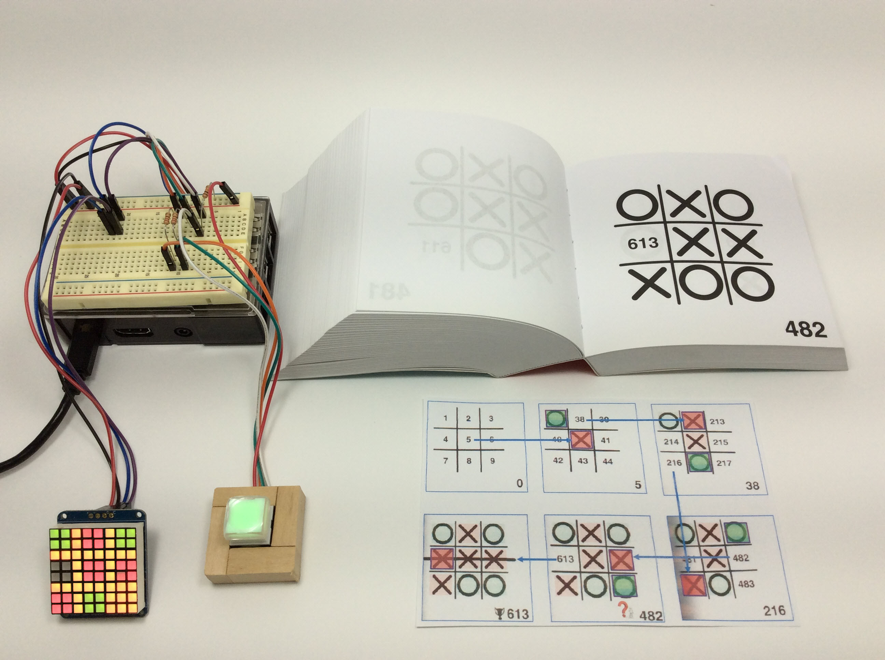
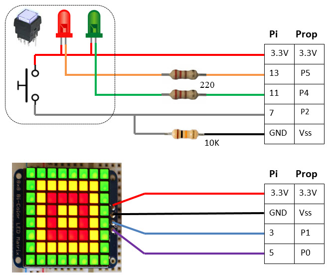
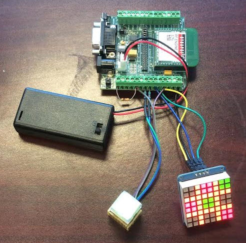
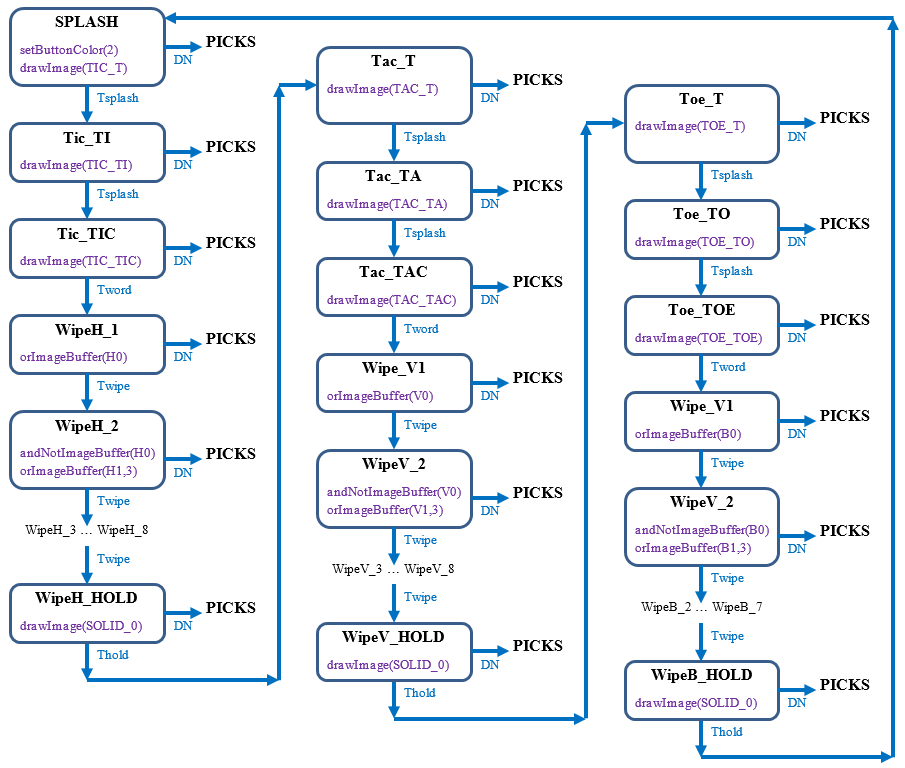
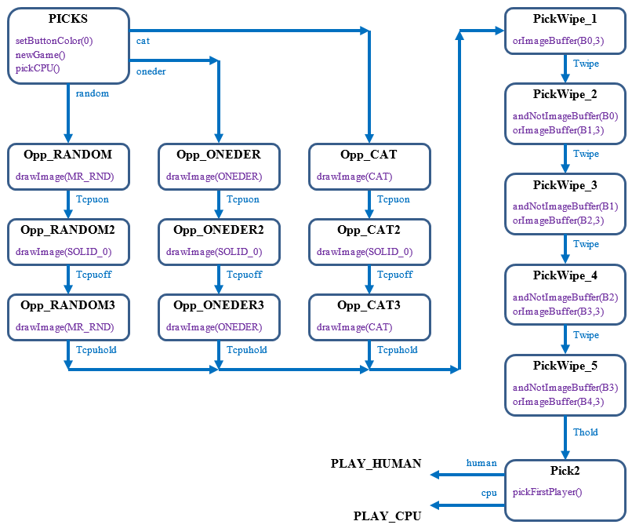
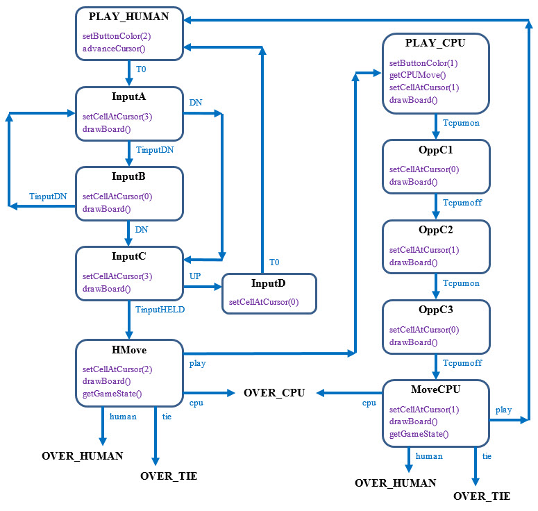
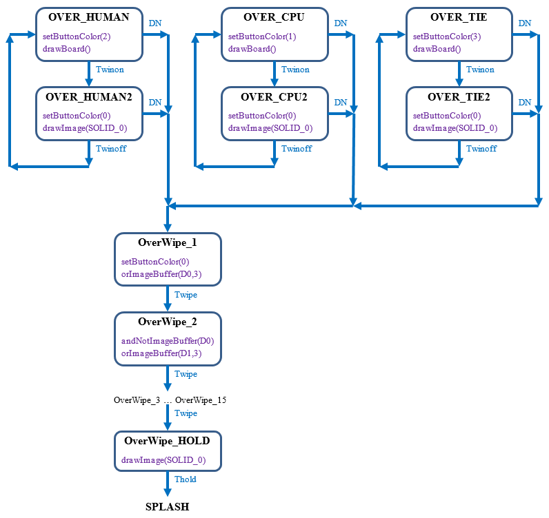

# Declarative Finite State Machines

### As seen on Adafruit Show and Tell 

https://youtu.be/q3QH9htYY7w?t=445

### Published in Circuit Cellar, July 2017

# Links
8x8 LED Display: 
http://www.adafruit.com/product/902

LED Button (Mouser P/N: 633-15ACBKG036CF-2SJB): 
http://www.mouser.com/search/ProductDetail.aspx?R=0virtualkey0virtualkeyKP0115ACBKG036CF-2SJB

HT16K133 LED Matrix Backpack Driver: 
http://obex.parallax.com/object/747

Tic Tac Tome: 
http://www.amazon.com/Tic-Tac-Tome-Autonomous-Playing/dp/1594746877

Installing node.js on Raspberry Pi: 
https://learn.adafruit.com/node-embedded-development/installing-node-dot-js

# Hardware

Here is the tic-tac-toe state machine in action. The Raspberry Pi is on the left running the state machine in NodeJS (JavaScript). The Parallax Propeller is on the right running the state machine in SPIN. Both platforms use the same hardware. The left button has a wooden sleeve I built for stability.

The Raspberry Pi playing the Tic Tac Toe Tome. The Pi found the one winning case coded purposefully into the book.

The hardware schematics and connections to the CPUs.

An older version of the hardware running on the Synapse SN171 proto board.

# Tic Tac Toe State Machine

The bubbles in the diagram below are the individual states. The purple function calls are made when the machine enters the state. The blue arrows show events and the target state.

## Splash Screens

This part of the state machine is an attract mode. The machine shows the individual letters for the words "TIC", "TAC", and "TOE" and sweeps the display clean with a line between. Press the button to start the game in the "PICKS" state.

## Pick a Game

This part of the machine picks a computer player and decides who goes first.
 

## Game Play

This part of the machine includes the player's input loop. You press the button and quickly release it to advance the cursor. If you hold the button down you enter the move. The cursor only stops at available cells. The machine alternates between player and CPU until there is a win or a tie.

## Game Over

This part of the machine shows the winner of the game. The button flashes the color of the winner (orange for tie) until you press the button. Then the machine returns to the splash mode.

